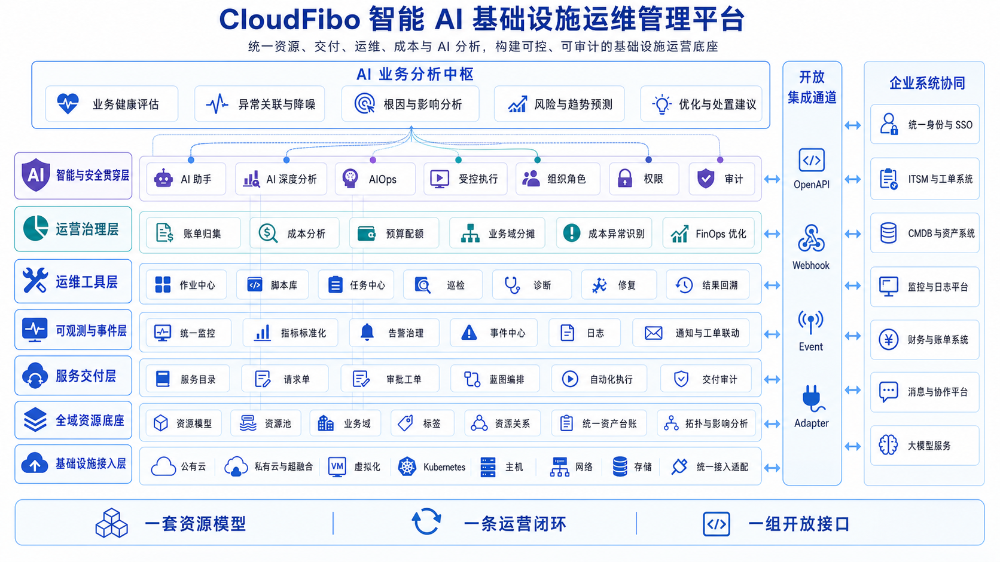
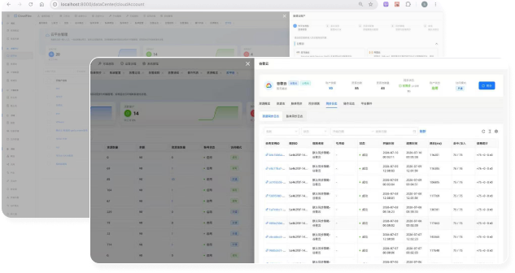
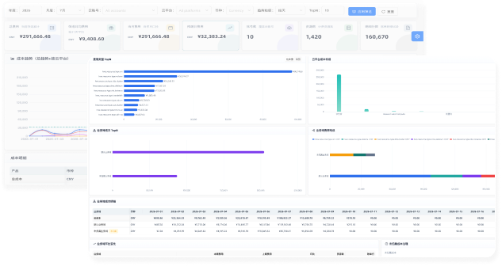
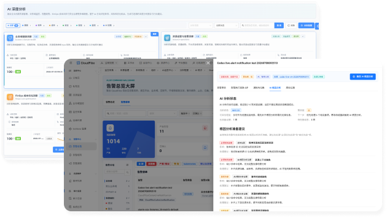

<p align="center">
  
</p>

<h1 align="center">CloudFibo 智能 AI 基础设施运维管理平台</h1>

<p align="center">
  统一资源、交付、运维、成本与 AI 分析，构建可控、可审计的基础设施运营底座
</p>

<p align="center">
  <strong>简体中文</strong> · <a href="README_EN.md">English</a>
</p>

<p align="center">
  <a href="https://cloudfibo.com">官方网站</a> ·
  <a href="docs/DEPLOYMENT.md">快速部署</a> ·
  <a href="docs/LICENSE_REQUEST.md">申请 License</a> ·
  <a href="https://github.com/happygnip/cloudfibo/discussions">社区交流</a>
</p>

CloudFibo 面向公有云、私有云、虚拟化、Kubernetes 与关键 IT 基础设施，以统一资源模型和业务域为基础，将资源、关系、监控、告警、事件、任务与成本数据连接到同一平台，让平台团队和运维团队在清晰的权限、审批与审计边界内完成基础设施运营。

## 平台架构

<p align="center">
  
</p>

CloudFibo 用一套资源模型贯通基础设施接入、资产管理、服务交付、可观测、自动化、FinOps 与 AI 运维，并通过 OpenAPI、Webhook、事件和适配器连接企业现有系统。

## 核心能力

| 能力支柱 | 主要能力 | 带来的价值 |
| --- | --- | --- |
| 统一资源底座 | 多云账号接入、资源同步、标准资源模型、关系拓扑、业务域归属 | 建立持续更新、可查询、可审计的基础设施事实底座 |
| 标准化服务交付 | 服务目录、动态申请、策略审批、蓝图编排、自动执行、结果回写 | 将复杂基础设施能力变成可复用、可追踪的标准服务 |
| 智能运维闭环 | 统一监控、告警治理、事件中心、日志关联、任务作业、AI 辅助分析 | 缩短从发现问题到分析、处置、验证和复盘的路径 |
| 运营与安全治理 | 多云账单、成本分摊、预算与优化、组织权限、受控执行、操作审计 | 让成本责任清晰，让自动化和 AI 有边界、有证据、可追溯 |

## 产品界面

<table>
  <tr>
    <td width="50%" align="center">
      <br />
      <strong>多云资源统一纳管</strong><br />
      <sub>连接异构云平台，持续同步资源、状态、标签与关系。</sub>
    </td>
    <td width="50%" align="center">
      <br />
      <strong>FinOps 成本治理</strong><br />
      <sub>统一账单、成本归集、业务分摊、趋势分析与持续优化。</sub>
    </td>
  </tr>
</table>

<p align="center">
  <br />
  <strong>AI 深度分析与受控处置</strong><br />
  <sub>关联资源、指标、告警、事件、任务和成本证据，输出可解释的分析与行动建议。</sub>
</p>

> 截图使用演示数据，用于展示产品能力与交互形态；不同版本和 License 的实际功能可能不同。

## 基础设施覆盖

- 公有云：AWS、Azure、Google Cloud、阿里云、华为云、腾讯云、百度智能云、京东云、天翼云、移动云、火山引擎等。
- 私有云与虚拟化：VMware、Proxmox、ZStack、CloudTower、FusionCompute、Huawei HCS/HCSO、SCP 等。
- 云原生：Kubernetes、Rancher，以及容器集群、节点、工作负载和相关资源。

具体资源类型和操作能力会因 CloudFibo 版本、云平台 API 与 License 版本不同，请以对应 Release 的兼容性说明为准。

## 快速开始

CloudFibo 提供 Docker Compose 单机部署方式。正式安装包通过 GitHub Releases 发布，并同步存储到阿里云 OSS：

- [Docker Compose 完整部署说明](docs/DEPLOYMENT.md)
- [v3.3.5-build.2026070801 离线镜像包](https://cloudfibo-release.oss-cn-beijing.aliyuncs.com/compose/3.3.5/v3.3.5-build.2026070801/cloudfibo-compose-v3.3.5-build.2026070801.tar)

```bash
# 下载并解压 Release 或 OSS 中的 cloudfibo-compose-<version>.tar.gz
cd deploy/docker-compose
chmod +x ./deploy.sh
./deploy.sh --public-origin "https://localhost:8443" --gateway-https-port 8443
```

脚本会生成随机凭据与运行配置、准备本地 HTTPS 证书、拉取镜像、启动服务并执行健康检查。完成后访问：

```text
https://<服务器 IP 或域名>:8443/
```

## License

安装包可以免费下载和部署；CloudFibo 产品功能通过离线 License 授权。平台生成安装实例指纹，申请人通过邮件提交必要信息，审核后收到签名的 `.lic` 文件，并在“系统管理 → 许可证”页面导入。

- [License 申请流程与邮件模板](docs/LICENSE_REQUEST.md)
- License 在本地进行数字签名校验，正常使用不要求生产环境持续连接外部授权服务。
- 请勿在公开 Issue 或 Discussion 中提交平台指纹、License、公司联系人或其他敏感信息。

## 社区与支持

- 使用问题、实践经验与功能建议：[GitHub Discussions](https://github.com/happygnip/cloudfibo/discussions)
- 可复现的软件缺陷：[GitHub Issues](https://github.com/happygnip/cloudfibo/issues)
- 部署咨询、商务合作与 License：`postmaster@cloudfibo.com`
- 安全问题：请按 [SECURITY.md](SECURITY.md) 私下报告

更多说明见 [SUPPORT.md](SUPPORT.md) 和 [CONTRIBUTING.md](CONTRIBUTING.md)。

## 项目与许可说明

本仓库用于 CloudFibo 产品介绍、公开文档、安装入口和社区协作，不代表 CloudFibo 产品源代码采用开源许可。安装包、容器镜像及产品功能的使用以对应 Release 的最终用户许可协议和 License 授权范围为准，详情见 [LEGAL.md](LEGAL.md)。

Copyright © CloudFibo. All rights reserved.
