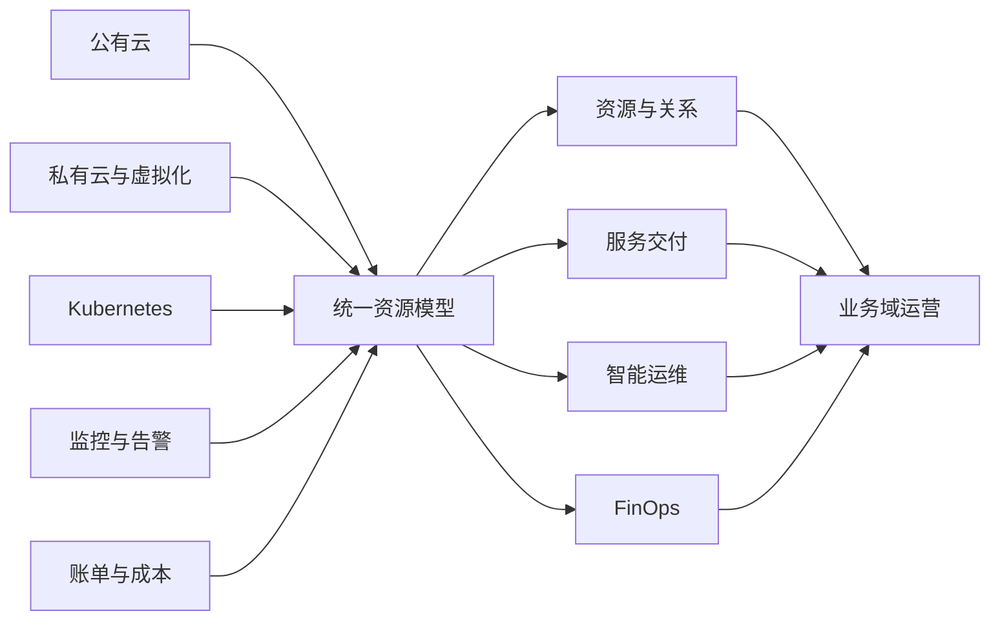

# CloudFibo

> 面向公有云、私有云、虚拟化、Kubernetes 与关键 IT 基础设施的智能多云管理与 FinOps 平台。

[官网](https://cloudfibo.com) · [快速部署](docs/DEPLOYMENT.md) · [申请 License](docs/LICENSE_REQUEST.md) · [获得支持](SUPPORT.md)

CloudFibo 以统一资源模型和业务域为基础，将分散的云资源、监控告警、运维流程与成本数据连接到同一平台，帮助企业建立统一、智能、可控的基础设施运营底座。

## 为什么选择 CloudFibo

| 能力 | 说明 |
| --- | --- |
| 多云统一纳管 | 连接公有云、私有云、虚拟化、超融合与 Kubernetes，持续同步资源、状态、标签和关系。 |
| FinOps 成本治理 | 统一归集多云账单，支持成本分析、责任分摊、预算预警、异常识别与优化建议。 |
| 基础设施运营 | 提供资源台账、关系拓扑、监控告警、事件处置、任务作业和审计追溯。 |
| 服务交付与自动化 | 贯通服务目录、申请、审批、编排执行、结果回写与资源回收。 |
| 受控 AI 运维 | 基于真实资源和运维上下文辅助分析；写入动作受权限、确认、审批和审计约束。 |

## 平台视图



## 已覆盖的基础设施类型

- 公有云：AWS、Azure、Google Cloud、阿里云、华为云、腾讯云、百度智能云、京东云、天翼云、移动云、火山引擎等。
- 私有云与虚拟化：VMware、Proxmox、ZStack、CloudTower、FusionCompute、Huawei HCS/HCSO、SCP 等。
- 云原生：Kubernetes、Rancher，以及面向容器集群、节点、工作负载和相关资源的统一管理。

具体能力会因 CloudFibo 版本、云平台 API 和 License 版本而不同，请以对应 Release 的兼容性说明为准。

## 快速开始

CloudFibo 提供 Docker Compose 单机部署方式。正式公开安装包将通过 GitHub Releases 发布：

```bash
# 下载并解压 Release 中的 cloudfibo-compose-<version>.tar.gz
cd deploy/docker-compose
chmod +x ./deploy.sh
./deploy.sh --public-origin "https://localhost:8443" --gateway-https-port 8443
```

部署脚本会准备运行配置、生成随机凭据与本地证书、拉取镜像并启动服务。完成后访问：

```text
https://<服务器 IP 或域名>:8443/
```

完整前置条件、Windows 命令、验证与升级注意事项见[部署文档](docs/DEPLOYMENT.md)。

## License

安装包可以免费下载和部署；CloudFibo 产品功能通过离线 License 授权。平台会生成安装实例指纹，申请人通过邮件提交必要信息，审核后收到签名的 `.lic` 文件，并在平台的“系统管理 → 许可证”页面导入。

License 文件采用数字签名校验，不要求生产环境持续连接授权服务器。申请方法见 [License 申请说明](docs/LICENSE_REQUEST.md)。请勿在公开 Issue 或 Discussion 中提交平台指纹、公司联系人、电话或其他敏感信息。

## 社区与反馈

- 使用问题与经验交流：GitHub Discussions（仓库发布后启用）。
- 可复现的软件缺陷：GitHub Issues。
- 安全问题：请按 [SECURITY.md](SECURITY.md) 私下报告。
- 商务、部署与 License：`postmaster@cloudfibo.com`。

## 项目说明

本仓库用于 CloudFibo 产品介绍、公开文档、安装入口和社区协作，不代表 CloudFibo 产品源代码采用开源许可。安装包、容器镜像及产品功能的使用以随 Release 发布的最终用户许可协议和 License 授权范围为准。

Copyright © CloudFibo. All rights reserved.
